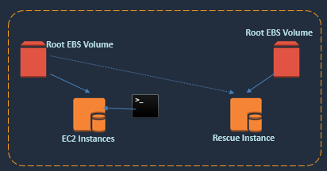

# EC2 Booting Issues Fix

## Overview

This project aims to resolve EC2 booting issues arising from incorrect entries in the `/etc/fstab` file. It covers the reproduction of the issue, two methods for fixing booting problems—EC2 Serial Console and Rescue Instance—and validation steps.



## Prerequisites

Ensure you have an active AWS account to create necessary infrastructure resources on the AWS cloud.

## Booting Issues

### Reproduce the Issue


1. Create an issue with incorrect `/etc/fstab` entries.
2. Attach a 5GB EBS volume (`/dev/xvdf`) to the EC2 instance.
3. Mount the file system on the `/data` directory and create a file named 'f1'.
4. Incorrectly update `/etc/fstab`: `/dev/xvdf /data ext4 defaults 1`.
5. Restart the EC2 instance from the AWS console.


## Fix the Booting Issues

### EC2 Serial Console

1. Open the Serial Console from the AWS console.
2. Correct the `/etc/fstab` entries:
    ```bash
    /dev/xvdf /data ext4 defaults 1 1
    ```

### Rescue Instance

1. Stop the problematic EC2 instance and detach the root volume.
2. Launch a Rescue Instance, attach the root volume as a data volume, and fix `/etc/fstab`.
3. 
4. Detach the volume, terminate the Rescue Instance, and reattach the root volume to the original EC2 instance.
5. 
6. Start the EC2 instance.

## Validation

Verify that the EC2 instance starts successfully.

## Comments

- Use the EC2 Serial Console to address issues related to incorrect `/etc/fstab` entries.
- The Rescue Instance method is effective when the EC2 instance encounters booting failures.
